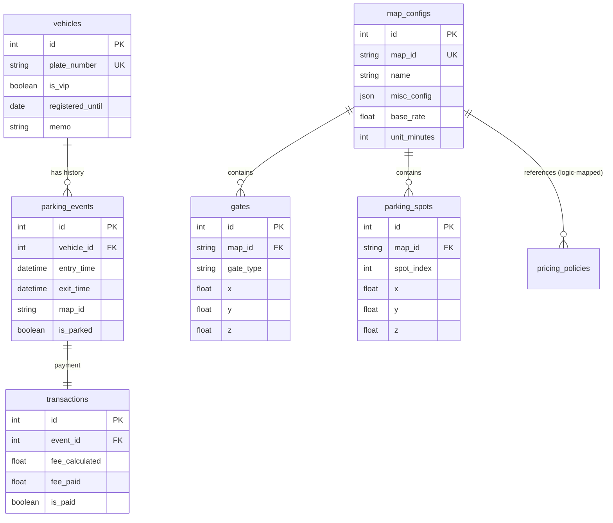

# 🗄️ Database Schema & Architecture

This document details the database structure of **OpenPMS-3D**.
The project utilizes **SQLite** (default) with **SQLAlchemy 2.0+ (Async ORM)** for data management.

본 문서는 **OpenPMS-3D**의 데이터베이스 구조를 상세히 설명합니다.
프로젝트는 **SQLite**를 기본으로 사용하며, **SQLAlchemy 2.0+ (Async ORM)**를 통해 데이터를 관리합니다.

---

## 📊 Overview (ER Diagram)

The following Diagram represents the relationships between core tables.
아래 다이어그램은 핵심 테이블 간의 관계를 나타냅니다.

---

## 📑 Table Details (테이블 상세)

### 1. `map_configs`
Stores configuration for each parking lot map (Scale, Pricing, Metadata).
각 주차장 맵의 설정(크기, 요금, 메타데이터)을 저장합니다.

| Column | Type | Description (설명) |
| :--- | :--- | :--- |
| `id` | PK | Unique ID |
| `map_id` | String | Unique Identifier (e.g., `mall`, `standard`) |
| `name` | String | Display Name (e.g., "The Hyundai Seoul") |
| `capacity` | Integer | Total Parking Capacity |
| `base_rate` | Float | Basic fee for the first unit time (기본 요금) |
| `unit_minutes` | Integer | Charging interval in minutes (단위 시간) |
| `max_daily_fee` | Float | Maximum fee cap for 24 hours (일일 최대 요금) |
| `misc_config` | JSON | Stores Camera position, Path nodes, etc. |

### 2. `parking_spots`
Stores 3D coordinates for every parking spot generated in the map.
맵에 생성된 모든 주차면의 3D 좌표를 저장합니다.
*   **Linked to**: `map_configs` (via `map_id`)
*   **Usage**: Used to visualize spots (`FloorStatusBoard`) and validate parking logic.

| Column | Type | Description (설명) |
| :--- | :--- | :--- |
| `id` | PK | Unique ID |
| `map_id` | String | FK to Map Config |
| `spot_index` | Integer | Logical index of the spot (0 ~ N) |
| `x`, `y`, `z` | Float | 3D Coordinates in the scene |

### 3. `parking_events`
Records entry and exit history for all vehicles.
모든 차량의 입출차 기록을 저장합니다.

| Column | Type | Description (설명) |
| :--- | :--- | :--- |
| `id` | PK | Unique ID |
| `vehicle_id` | Integer | FK to `vehicles` table |
| `entry_time` | DateTime | Time of entry |
| `exit_time` | DateTime | Time of exit (Null if currently parked) |
| `map_id` | String | Where the event occurred |
| `is_parked` | Boolean | True if car is currently inside |
| `parking_spot` | String | Assigned spot index (e.g., "105") |

### 4. `transactions`
Handles fee calculation and payment records.
요금 계산 및 결제 기록을 처리합니다.

| Column | Type | Description (설명) |
| :--- | :--- | :--- |
| `id` | PK | Unique ID |
| `event_id` | Integer | FK to `parking_events` |
| `fee_calculated` | Float | Total calculated fee |
| `fee_paid` | Float | Actual amount paid |
| `is_paid` | Boolean | Payment status |

### 5. `vehicles`
Stores registered vehicle information.
등록된 차량 정보를 저장합니다.

| Column | Type | Description (설명) |
| :--- | :--- | :--- |
| `id` | PK | Unique ID |
| `plate_number` | String | License Plate (Unique) |
| `is_vip` | Boolean | VIP Status (Discounts may apply) |

---

## 🛠️ Management Tools (관리 도구)

### `reset_db.py`
*   **Purpose**: Fully resets the database schema and seeds initial data (`standard`, `gangnam`, `mall` maps).
*   **Effect**: Drops all tables and recreates them.
*   **Usage**: `python reset_db.py`
